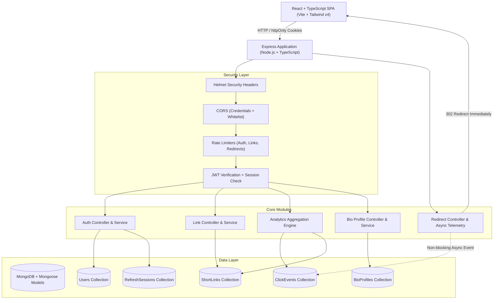
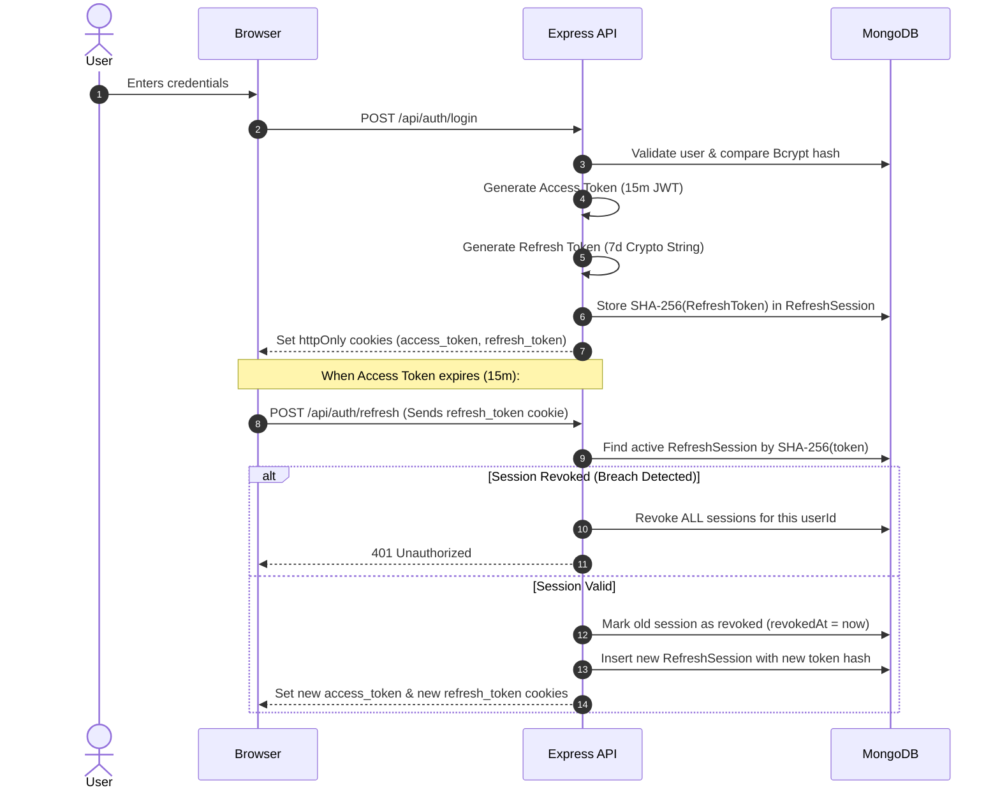

# LynxHub — Branded Short-Link & Bio-Link Hub

A production-grade, multi-tenant MERN SaaS platform combining Bitly-style branded URL shortening with deep click telemetry and a Linktree-style creator link-in-bio profile builder.

Designed, structured, and tested to meet high standards of software architecture, clean separation of concerns, and robust security.

---

## Table of Contents
- [1. Overview](#1-overview)
- [2. Core Features](#2-core-features)
- [3. Tech Stack & Dependencies](#3-tech-stack--dependencies)
- [4. System Architecture](#4-system-architecture)
- [5. Project Structure](#5-project-structure)
- [6. Database Design & MongoDB Indexes](#6-database-design--mongodb-indexes)
- [7. Authentication Flow & Token Rotation](#7-authentication-flow--token-rotation)
- [8. Click Telemetry & Privacy Engineering](#8-click-telemetry--privacy-engineering)
- [9. Aggregation Pipelines & Analytics](#9-aggregation-pipelines--analytics)
- [10. Link-in-Bio Profile Engine](#10-link-in-bio-profile-engine)
- [11. Security Engineering](#11-security-engineering)
- [12. Environment Variables](#12-environment-variables)
- [13. Local Setup & Zero-Config Database](#13-local-setup--zero-config-database)
- [14. Running the Application](#14-running-the-application)
- [15. Automated Testing Suite](#15-automated-testing-suite)
- [16. Assessment Presentation Guide (15 Key Questions)](#16-assessment-presentation-guide-15-key-questions)
- [17. Assumptions, Limitations & Future Improvements](#17-assumptions-limitations--future-improvements)

---

## 1. Overview

**LynxHub** is an enterprise-ready SaaS application that provides digital creators, marketers, and businesses with two interconnected capabilities:
1. **URL Shortener & Telemetry Hub**: Transform long URLs into 6-character short codes or custom vanity slugs (e.g. `/r/summer-sale`), backed by non-blocking 302 redirects and privacy-preserving click telemetry.
2. **Link-in-Bio Creator Profile**: A Linktree-style public creator landing page (e.g. `/bio/alice`) with live mobile preview, customizable themes (*Minimal Light*, *Dark Slate*, *Vibrant Gradient*), and reorderable social links.

---

## 2. Core Features

### A. URL Shortening & Redirection
- **Automatic 6-Character Base62 Generator**: Uses cryptographically secure random bytes with an automatic collision retry loop.
- **Custom Vanity Slugs**: Users can claim readable custom slugs (`/r/black-friday`).
- **Collision Detection & Resolution**: Atomic detection of existing slugs with HTTP 409 Conflict errors.
- **Reserved Route Protection**: Configurable blacklist preventing collisions with system routes (`api`, `admin`, `login`, `dashboard`, `r`, etc.).
- **Immediate HTTP 302 Redirects**: Performs single-index MongoDB lookups and redirects clients without blocking on telemetry processing.
- **Asynchronous Click Telemetry**: Telemetry events are dispatched in a decoupled background task (`setImmediate`), guaranteeing sub-millisecond response latency.

### B. Click Telemetry & Analytics
- **Privacy-Conscious Hashed IP Tracking**: Client IP addresses are **never** stored in plaintext. They are salted with a server-side secret and hashed using SHA-256.
- **Client Device Classification**: User-Agent parsing categorizes traffic into `Mobile`, `Tablet`, `Desktop`, or `Unknown`.
- **Referrer Domain Normalization**: Cleans HTTP Referrer headers to distinguish external origins (`twitter.com`, `linkedin.com`) from direct traffic.
- **Advanced Aggregation Pipelines**: Real-time aggregation of total clicks, unique visitors, clicks over time, device distributions, and top referrers with dynamic date filtering (`7d`, `30d`, `90d`, `all`).

### C. Link Library Dashboard
- **Backend Search API**: Full text search over slugs, titles, and target URLs handled directly by MongoDB.
- **Server-Side Pagination**: Efficient pagination handling large collections.
- **Actionable Link Rows**: Copy-to-clipboard with visual feedback, QR code generation and SVG download, link-specific telemetry shortcuts, and safe deletion confirmation.

### D. Link-in-Bio Builder & Public Profiles
- **Dual-Pane Interactive Editor**: Left side controls profile attributes, avatar presets (DiceBear), display names, bio descriptions, and theme selection; Right side features a live reactive mobile smartphone frame.
- **Reorderable Social Links**: Add, edit, toggle, reorder, or remove social link cards.
- **Three Custom Themes**:
  - *Minimal Light*: Clean white card aesthetics with crisp borders and dark typography.
  - *Dark Slate*: Midnight slate styling with emerald accents and subtle borders.
  - *Vibrant Gradient*: Rich purple-indigo gradient with frosted glassmorphic buttons.
- **Public Profile (`/bio/:username`)**: High-performance public route accessible without authentication, fully responsive across mobile (390px, 430px), tablet (768px), and desktop (1280px+).

---

## 3. Tech Stack & Dependencies

### Backend
- **Runtime**: Node.js v22 (TypeScript strict mode)
- **Framework**: Express.js
- **Database**: MongoDB + Mongoose ODM (with automatic fallback to embedded `mongodb-memory-server` for turnkey evaluation)
- **Authentication**: JSON Web Tokens (`jsonwebtoken`) + Bcrypt (`bcryptjs`)
- **Security**: Helmet, CORS with credentials, Cookie-Parser, Express-Rate-Limit
- **Validation**: Zod
- **Testing**: Vitest + Supertest

### Frontend
- **Framework**: React 18 + Vite + TypeScript
- **Styling**: Tailwind CSS v4 + Custom Glassmorphism design tokens
- **Component Primitives**: Coss UI-inspired primitives (Button, Input, Card, Dialog, Badge, Tabs, Table, Avatar)
- **Charts & Visualization**: Recharts (AreaChart, PieChart, BarChart)
- **Icons**: Lucide React
- **QR Code Engine**: `qrcode.react`

---

## 4. System Architecture



---

## 5. Project Structure

```
lynxhub/
├── server/
│   ├── src/
│   │   ├── config/              # Env parsing, DB connection manager (dual-mode)
│   │   ├── controllers/         # HTTP request orchestration
│   │   ├── middleware/          # Auth, Rate limiting, Zod validation, Centralized Error Handling
│   │   ├── models/              # User, RefreshSession, ShortLink, ClickEvent, BioProfile
│   │   ├── routes/              # Auth, Link, Analytics, Bio, Redirect routers
│   │   ├── services/            # Business logic, Token rotation, Telemetry, Aggregations
│   │   ├── utils/               # SHA-256 IP hashing, Shortcode generator, Reserved slugs
│   │   ├── validators/          # Zod schemas for all request payloads
│   │   ├── types/               # TypeScript interfaces & Express augmentations
│   │   ├── app.ts               # Express configuration & middleware pipeline
│   │   └── server.ts            # Entrypoint & graceful shutdown handlers
│   ├── tests/                   # Automated Vitest integration test suite
│   ├── .env.example
│   ├── package.json
│   └── tsconfig.json
├── client/
│   ├── src/
│   │   ├── components/
│   │   │   ├── ui/              # Coss UI primitives (Button, Input, Card, Dialog, Badge, Tabs, Table)
│   │   │   ├── layout/          # Navbar, Sidebar, DashboardLayout
│   │   │   └── links/           # CreateLinkModal, QrCodeModal, DeleteConfirmDialog
│   │   ├── pages/
│   │   │   ├── auth/            # Login, Signup, VerifyEmail, ForgotPassword, ResetPassword
│   │   │   ├── dashboard/       # OverviewPage
│   │   │   ├── links/           # LinksPage (Link Library)
│   │   │   ├── analytics/       # AnalyticsPage (Visualizations)
│   │   │   ├── bio/             # BioEditorPage (Split screen) & PublicBioPage
│   │   │   └── settings/        # SettingsPage
│   │   ├── context/             # AuthContext & ToastContext
│   │   ├── lib/                 # Centralized api client with 401 refresh interceptor
│   │   ├── types/               # Frontend TypeScript definitions
│   │   ├── App.tsx              # React Router tree
│   │   └── index.css            # Tailwind CSS v4 design tokens
│   ├── package.json
│   ├── tsconfig.json
│   └── vite.config.ts
├── docs/
│   └── API.md                   # Complete REST API specification
├── REQUIREMENTS.md              # Requirement verification checklist
├── package.json                 # Monorepo scripts (concurrent dev, test, build)
└── README.md
```

---

## 6. Database Design & MongoDB Indexes

### 1. `User` Collection
- `email`: Indexed & unique. Ensures fast lookup during login and guarantees single-account ownership per email.
- `username`: Indexed & unique. Ensures fast resolution for vanity profile URLs (`/bio/:username`).
- `emailVerificationTokenHash`: Sparse index. Fast lookup for simulated email verification.
- `passwordResetTokenHash`: Sparse index. Fast lookup for unexpired reset requests.

### 2. `RefreshSession` Collection
- `tokenHash`: Indexed. Instant session lookup when rotating refresh tokens.
- `{ userId: 1, revokedAt: 1 }`: Compound index. Enables lightning-fast revocation of all user sessions upon password reset or security breach.
- `expiresAt`: **TTL (Time-To-Live) Index** with `expireAfterSeconds: 0`. MongoDB automatically cleans up expired sessions without needing background cron workers.

### 3. `ShortLink` Collection
- `shortCode`: **Indexed & unique**. Enables sub-millisecond lookup during high-throughput `GET /r/:shortCode` redirects.
- `{ userId: 1, createdAt: -1 }`: Compound index. Powers user link listing and server-side pagination with sorted order without in-memory sorting penalties.

### 4. `ClickEvent` Collection
- `{ shortLinkId: 1, timestamp: -1 }`: Compound index. Powers link-specific analytics queries and date range filters.
- `{ userId: 1, timestamp: -1 }`: Compound index. Powers account-level overview aggregations across all links owned by a user.
- `{ shortLinkId: 1, deviceType: 1 }`: Compound index. Fast device breakdown aggregations.
- `{ shortLinkId: 1, referrerDomain: 1 }`: Compound index. Fast referrer breakdown aggregations.

### 5. `BioProfile` Collection
- `username`: Indexed & unique. Direct resolution for public profile traffic.
- `userId`: Indexed & unique. 1-to-1 association with User record.

---

## 7. Authentication Flow & Token Rotation



---

## 8. Click Telemetry & Privacy Engineering

1. **Non-Blocking Telemetry**: When a visitor requests `GET /r/:shortCode`, the server executes an indexed query on `ShortLink.findOne({ shortCode })`. The HTTP 302 redirect response with the `Location` header is dispatched to the client immediately. Telemetry writes are scheduled using Node's `setImmediate()`, ensuring the redirect is never delayed by database writes.
2. **Salted SHA-256 IP Hashing**:
   ```typescript
   export function hashIp(ip: string): string {
     const normalizedIp = ip.trim().replace(/^::ffff:/, '');
     return crypto.createHash('sha256').update(`${normalizedIp}:${env.IP_HASH_SALT}`).digest('hex');
   }
   ```
   - Raw IP addresses are **never** persisted to MongoDB.
   - The server-side salt `IP_HASH_SALT` prevents rainbow table attacks.
   - Hashed IPs enable accurate counting of unique visitors without compromising visitor privacy.

---

## 9. Aggregation Pipelines & Analytics

The backend uses MongoDB Aggregation Pipelines to process large volumes of telemetry data in real time:

- **Clicks Over Time**: Groups records by date string `YYYY-MM-DD` and fills date gaps to provide a continuous time series for Recharts.
- **Device Distribution**: Groups records by `deviceType` and calculates proportions for Desktop, Mobile, Tablet, and Unknown.
- **Top Referrers**: Groups by `referrerDomain`, sorts descending by frequency, and returns top traffic origins with percentage calculations.

---

## 10. Link-in-Bio Profile Engine

- **Real-Time Synchronized Editing**: Modifying avatars, display names, bio descriptions, social links, or themes in the editor triggers immediate updates in the interactive smartphone mockup.
- **Social Links Management**: Supports platforms including GitHub, Twitter/X, LinkedIn, YouTube, Instagram, Spotify, Discord, and custom websites. Users can add, edit labels, reorder, or toggle visibility.
- **Multi-Theme Support**:
  - *Minimal Light*: Crisp monochrome aesthetic with clean borders.
  - *Dark Slate*: Sleek dark mode with emerald/zinc accents.
  - *Vibrant Gradient*: Rich purple-to-indigo backdrop with glassmorphic cards.

---

## 11. Security Engineering

- **Helmet**: Secures HTTP response headers against cross-site scripting and sniffing attacks.
- **CORS with Credentials**: Whitelists trusted frontend origins while enforcing secure cookie transmission.
- **Layered Rate Limiting**:
  - Authentication endpoints: 50 requests per 15 minutes.
  - Short link creation: 60 requests per minute.
  - Short redirect: 500 requests per minute.
- **Input & Schema Validation**: Strict Zod schemas sanitize and validate all request bodies, query params, and URL parameters.
- **Multi-Tenant Authorization**: Every link and bio query strictly verifies `userId === req.user.id`. Cross-user data leakage is strictly prevented.

---

## 12. Environment Variables

The application reads from `server/.env`. A complete template is provided in `server/.env.example`:

```bash
# Server Configuration
PORT=5000
NODE_ENV=development

# Database Configuration
# Leave blank to automatically launch embedded MongoDB for zero-config testing!
MONGODB_URI=

# Security & Tokens
JWT_ACCESS_SECRET=super_secret_access_key_min_32_chars_long_lynxhub
JWT_REFRESH_SECRET=super_secret_refresh_key_min_32_chars_long_lynxhub
JWT_ACCESS_EXPIRES_IN=15m
JWT_REFRESH_EXPIRES_IN=7d

# Privacy-preserving IP Telemetry Salt
IP_HASH_SALT=lynxhub_privacy_telemetry_salt_change_in_production

# Frontend Client URL & Cookie Configuration
CLIENT_URL=http://localhost:5173
COOKIE_DOMAIN=localhost

# Rate Limiting
RATE_LIMIT_AUTH_MAX=50
RATE_LIMIT_AUTH_WINDOW_MS=900000
RATE_LIMIT_LINK_CREATE_MAX=60
RATE_LIMIT_LINK_CREATE_WINDOW_MS=60000
RATE_LIMIT_REDIRECT_MAX=500
RATE_LIMIT_REDIRECT_WINDOW_MS=60000
```

---

## 13. Local Setup & Zero-Config Database

LynxHub includes an **Intelligent Dual-Mode Database Connector**:
1. If `MONGODB_URI` is provided in `server/.env`, it connects to your local or Atlas cluster.
2. If `MONGODB_URI` is omitted or blank, it **automatically boots an embedded `mongodb-memory-server`**.

> [!NOTE]
> This means any technical assessor or developer can run this project **immediately** without having to install, configure, or start a local MongoDB daemon!

---

## 14. Running the Application

### Prerequisites
- Node.js v18+ (v20 or v22 recommended)
- npm v9+

### 1. Install Dependencies
```bash
npm install
```

### 2. Run in Development Mode
Run both backend Express server and Vite frontend concurrently:
```bash
npm run dev
```
- **Backend API**: `http://localhost:5000`
- **Frontend App**: `http://localhost:5173`

Or run them individually:
```bash
npm run dev:server
npm run dev:client
```

### 3. Build for Production
```bash
npm run build
```

---

## 15. Automated Testing Suite

The backend features an automated integration test suite built with **Vitest**, **Supertest**, and **mongodb-memory-server**.

To run the tests:
```bash
npm run test
```

### Test Coverage Highlights:
- **Auth**: User registration, password hashing, duplicate email rejection, login, cookie setting, refresh token rotation, token reuse breach detection, email verification simulation, forgot/reset password flow.
- **Links**: Auto-generated 6-char codes, custom slugs, collision handling, reserved slug rejection, invalid URL rejection, user ownership isolation, search and server-side pagination.
- **Redirect & Telemetry**: 302 redirection, async click telemetry event creation, device classification, salted IP hashing, and aggregation metrics calculation.
- **Bio Profile**: Profile updates, theme changes, social link reordering, and public creator access at `GET /api/bio/:username`.

---

## 16. Assessment Presentation Guide (15 Key Questions)

Be prepared to answer these technical architectural questions during your interview:

### 1. Why MERN?
MERN provides an end-to-end JavaScript/TypeScript ecosystem. Sharing types and data structures between frontend and backend reduces context switching and eliminates impedance mismatch between client models and JSON-centric document storage.

### 2. Why MongoDB?
MongoDB’s flexible document model is a natural fit for hierarchical, polymorphic data like social links embedded in bio profiles, and time-series telemetry events that benefit from high write throughput and aggregation pipelines.

### 3. Why JWT?
JSON Web Tokens provide a stateless, digitally signed mechanism to transmit user identity. The backend verifies incoming signatures in CPU memory without querying the database for every single API request, ensuring horizontal scalability.

### 4. Why Access + Refresh Tokens?
Access tokens are short-lived (15 minutes) to minimize the damage if a token is intercepted. Refresh tokens are long-lived (7 days) and tracked in MongoDB, enabling seamless user sessions while retaining the power to revoke compromised devices.

### 5. Why httpOnly Cookies?
Storing tokens in `httpOnly` cookies makes them completely inaccessible to client-side JavaScript, neutralizing Cross-Site Scripting (XSS) token theft.

### 6. How does Token Rotation work?
Every time `/api/auth/refresh` is called, the existing refresh session is revoked and a new refresh token is issued. If a revoked token is ever presented again, the server detects potential token reuse and immediately revokes all active sessions for that user.

### 7. How are Slug Collisions prevented?
`ShortLink` enforces a unique MongoDB index on `shortCode`. Custom vanity slugs are checked before insertion, and auto-generated codes feature a collision-detection retry loop. If a concurrent race condition occurs, Mongoose catches duplicate key error `11000` and returns a 409 Conflict.

### 8. Why are Indexes needed?
Without indexes, MongoDB performs collection scans (`COLLSCAN`), inspecting every document in the database ($O(N)$). Indexes create B-trees ($O(\log N)$), ensuring fast redirects even with millions of links.

### 9. How does Asynchronous Click Tracking work?
When a redirect request arrives, the server immediately resolves the URL and responds with HTTP 302. Click recording is dispatched asynchronously using Node's `setImmediate()`, ensuring the user redirect is never blocked by database telemetry writes.

### 10. How is IP Privacy handled?
Raw IP addresses are never saved to disk. The server combines the incoming IP with a server-side secret (`IP_HASH_SALT`) and hashes it using SHA-256. This enables unique visitor calculations while preventing reverse identification.

### 11. How does Analytics Aggregation work?
We use MongoDB `$match`, `$group`, `$project`, and `$dateToString` aggregation pipeline stages to calculate total clicks, unique visitors, device distributions, and daily time series directly on the database cluster.

### 12. How does Rate Limiting prevent abuse?
`express-rate-limit` tracks client request frequencies in sliding windows, returning HTTP 429 when thresholds are crossed. This prevents brute-force login attempts, database flooding via link creation, and denial-of-service on redirect routes.

### 13. How are users prevented from accessing each other's data?
Every private query explicitly includes `{ userId: req.user.id }`. Even if a user knows the ObjectId of another user’s link, the query returns 404/403 because the ownership condition fails.

### 14. Why are Frontend and Backend separated?
Separating client and server allows independent scaling, deployment, and testing. The frontend is a static bundle served via CDN/Vite, while the backend is an API that could serve web, mobile, or third-party integrations.

### 15. Why were these UI libraries selected?
Tailwind CSS v4 provides a performant, modern styling engine without runtime CSS-in-JS overhead. Coss UI primitives offer accessible, reusable UI components, Recharts delivers interactive visual analytics, and Lucide provides a cohesive icon set.

---

## 17. Assumptions, Limitations & Future Improvements

### Assumptions
- Email delivery is simulated for the technical assessment by logging verification and reset tokens directly to the terminal and providing a 1-click test banner in the UI.
- The default short code length of 6 Base62 characters supports over 56.8 billion unique combinations ($62^6$).

### Limitations
- In a massive distributed deployment, telemetry writes would benefit from a message queue (such as Redis Streams or Apache Kafka) before persisting to MongoDB.
- Rate limiting currently operates in-memory; scaling across multiple server instances would utilize Redis-backed rate limiting.

### Future Improvements
- Add custom domain mapping for enterprise users (e.g. `links.mybrand.com`).
- Add geo-IP lookup to map visitor clicks to country and city coordinates.
- Implement webhooks notifying creators when links exceed click milestones.
- Export analytics reports as PDF and CSV files.
